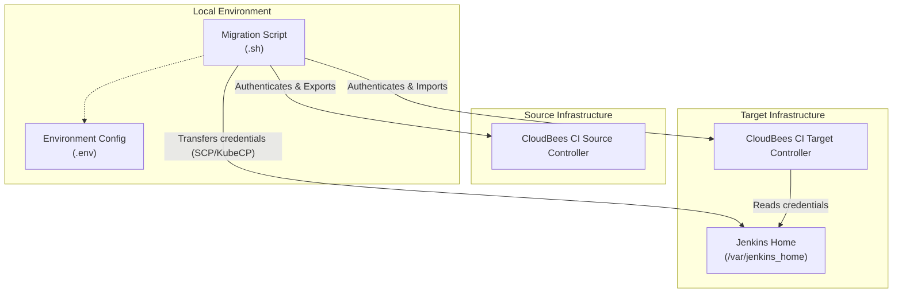
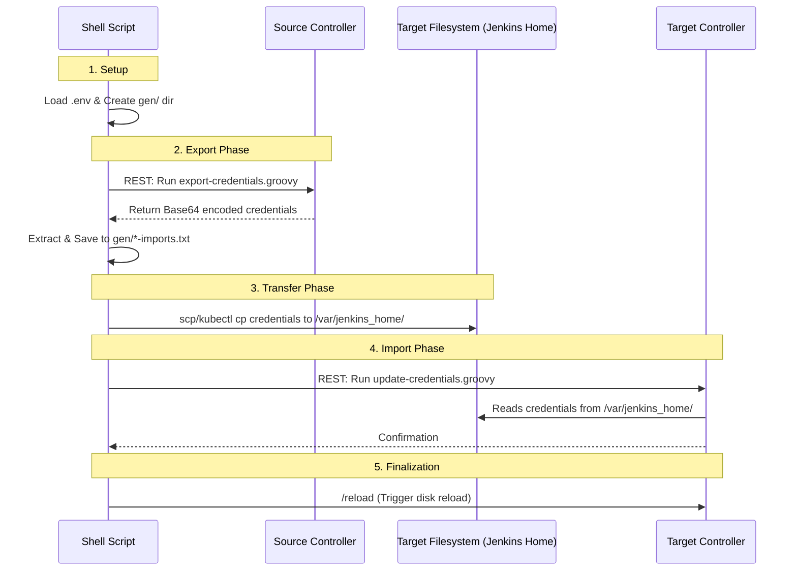

# CloudBees CI Credential Migration

Efficiently migrate credentials between CloudBees CI controllers. This repository provides automated scripts for both Kubernetes-based and Traditional (SSH-based) environments.

> [!NOTE]
> For more context on CloudBees CI migration strategies, refer to the [official documentation](https://docs.cloudbees.com/docs/cloudbees-ci-migration/latest/splitting-controllers/traditional-platforms).

## Architecture

Visual representation of the migration components and the execution lifecycle.

### Component Overview



### migration Lifecycle



## Features

- **Automated Export/Import**: Handles both Folder and System-level credentials.
- **Support for All Platforms**: Dedicated scripts for Kubernetes and Traditional infrastructures.
- **Secure**: Uses Jenkins User Tokens for authentication.

## Prerequisites

- `curl`: Used for API interactions with Jenkin controllers.
- `kubectl`: Required for Kubernetes-based migrations.
- `ssh`/`scp`: Required for Traditional platform migrations.
- **Jenkins User Token**: API tokens for both source and target controllers.

## Getting Started

### 1. Environment Configuration

Clone the template and adjust the variables to match your environment.

```bash
cp .env-template .env
```

Ensure the following variables are defined in your `.env` file:

| Variable | Description |
| :--- | :--- |
| `CONTROLLER_SOURCE_URL` | URL of the source Jenkins controller. |
| `CONTROLLER_TARGET_URL` | URL of the target Jenkins controller. |
| `CONTROLLER_SOURCE_USER_TOKEN` | `username:apitoken` for the source controller. |
| `CONTROLLER_TARGET_USER_TOKEN` | `username:apitoken` for the target controller. |
| `NAMESPACE` | (K8s only) Namespace of the target controller. |
| `TARGET_POD` | (K8s only) Name of the target controller pod. |
| `TARGET_USER` | (Trad only) SSH user for the target host. |
| `TARGET_HOST` | (Trad only) SSH host/IP of the target controller. |

### 2. Execution

Choose the script that matches your infrastructure:

#### Kubernetes Migration

```bash
chmod +x migrateCredentialsK8s.sh
./migrateCredentialsK8s.sh
```

#### Traditional Platform Migration

```bash
chmod +x migrateCredentialsTrad.sh
./migrateCredentialsTrad.sh
```

## Troubleshooting

If you encounter Base64 encoding issues during migration, use the utility script provided:

```bash
./fixb64encodingIssue.sh
```
